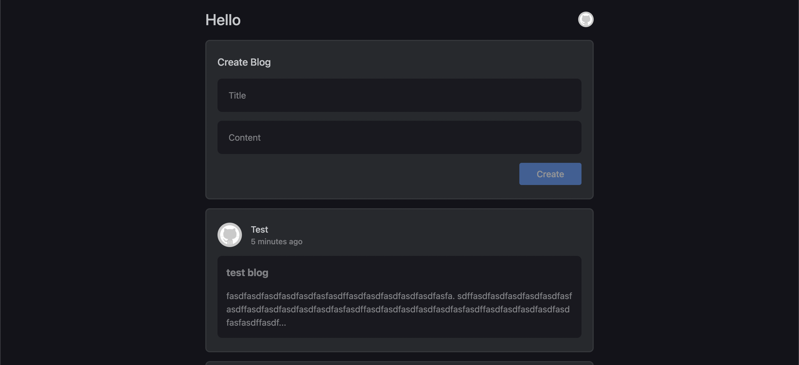
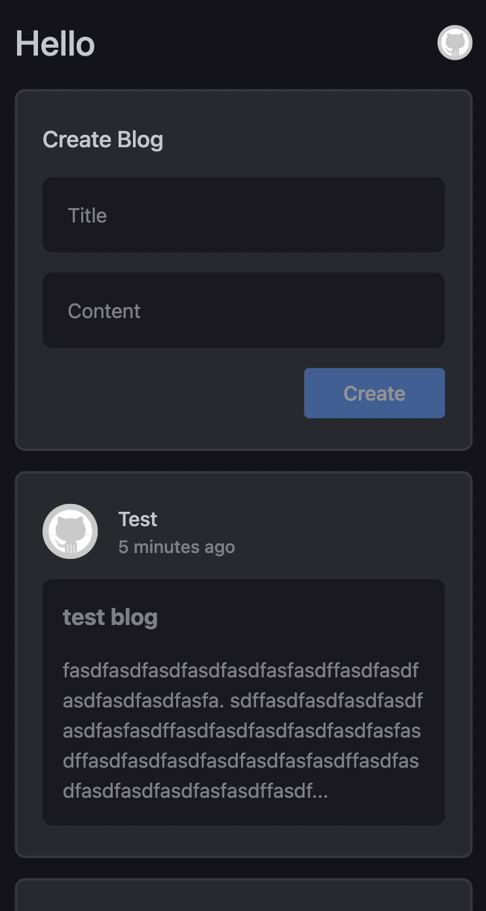

# BlogWeb

 

## Table of Contents

- [BlogWeb](#BlogWebx)
  - [Table of Contents](#table-of-contents)
  - [Tech Stack](#tech-stack)
    - [Backend:](#backend)
    - [Frontend](#frontend)
  - [Getting Started](#getting-started)
    - [Backend](#backend-1)
    - [Frontend](#frontend-1)
  - [API Endpoints](#api-endpoints)

## Tech Stack

### Backend:

- Node.js
- Express.js
- MongoDB

### Frontend

- React
- TailwindCSS
- @material-tailwind/react

## Prerequisite

You need to have a redis server running locally on your system. To install and run a server locally follow this documentation:- https://redis.io/docs/install/install-redis/

## Getting Started

1. You can run the below command which would install the packages simultaneously for both client and server:

```
npm run install
```

2. Start the backend server:

```
cd server && npm run dev
```

3. Start the frontend app:

```
cd client && npm run start
```

4. Frontend application should be up at: http://localhost:3000/ and backend server should be up at http://localhost:2000/

## API Endpoints

| Method | Endpoint             | Description               |
| ------ | -------------------- | ------------------------- |
| POST   | `/api/auth/register` | Registering a new user    |
| POST   | `/api/auth/login/`   | Login for registered user |
| GET    | `/api/auth/logout/`  | Logout for current user   |
| POST   | `/api/blogs/`        | Create a new blog         |
| GET    | `/api/blogs/`        | Retrieve all blogs        |
| GET    | `/api/blogs/:blogId` | Retrieve a specific blog  |
